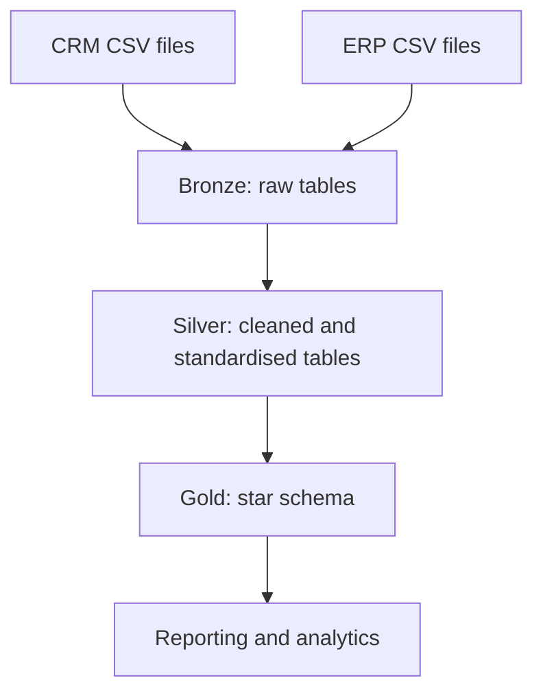

[README official.md](https://github.com/user-attachments/files/30456184/README.official.md)

# SQL Sales Data Warehouse

## Project Overview

This project demonstrates the design and implementation of an end-to-end data warehouse in Microsoft SQL Server. Sales data from two source systems—CRM and ERP—was imported from CSV files, cleaned, standardised, integrated, and transformed into a business-ready star schema.

The solution follows the Medallion Architecture:

- **Bronze layer:** preserves raw source data.
- **Silver layer:** cleans, standardises, and validates the data.
- **Gold layer:** presents integrated fact and dimension views for reporting and analysis.

The project was completed to strengthen my practical skills in SQL development, ETL design, data quality, data modelling, stored procedures, and technical documentation.

## Business Objective

The objective was to consolidate customer, product, and sales data from separate CRM and ERP systems into a single analytical model that can support:

- customer behaviour analysis;
- product performance analysis;
- sales trend reporting; and
- reliable, consistent business reporting.

## Tools and Technologies

- Microsoft SQL Server
- SQL Server Management Studio (SSMS)
- T-SQL
- CSV source files
- Draw.io
- Git and GitHub

## Data Architecture



### Bronze Layer

The Bronze layer stores the CRM and ERP data in its original form. Tables retain source-aligned names and structures, providing a traceable copy of the raw data before transformation.

The load process:

- truncates existing Bronze tables before each full refresh;
- uses `BULK INSERT` to load CSV files;
- keeps CRM and ERP datasets separated by source; and
- records load progress and duration to support troubleshooting.

### Silver Layer

The Silver layer prepares the source data for integration and analysis. Transformations include:

- removing unwanted spaces;
- handling duplicate records;
- replacing missing or invalid values;
- standardising coded values such as gender and marital status;
- correcting inconsistent product categories;
- converting text-based dates into valid SQL date fields;
- validating date sequences and business rules;
- deriving product end dates where required; and
- adding audit metadata such as load timestamps.

### Gold Layer

The Gold layer provides a business-friendly star schema built from the cleansed Silver data.

| Object | Type | Purpose |
|---|---|---|
| `gold.dim_customers` | Dimension | Consolidated customer attributes from CRM and ERP |
| `gold.dim_products` | Dimension | Product details, categories, subcategories, and maintenance information |
| `gold.fact_sales` | Fact | Sales transactions linked to customer and product dimensions |

Surrogate keys are generated for the dimension views, while the fact view uses those keys to connect sales transactions to the relevant customer and product records.

## ETL Workflow

1. Create the `DataWarehouse` database and the `bronze`, `silver`, and `gold` schemas.
2. Create source-aligned tables in the Bronze layer.
3. Load the CRM and ERP CSV files into Bronze tables.
4. Profile the raw data and identify quality issues.
5. Clean and standardise the data in the Silver layer.
6. Run validation checks against the transformed tables.
7. Integrate CRM and ERP entities in the Gold layer.
8. Build dimension and fact views for analytical use.
9. Validate relationships, uniqueness, and referential integrity.

## Data Quality Checks

Data quality tests were used throughout the project to confirm that:

- primary and business keys are unique;
- required fields are not null;
- unwanted spaces have been removed;
- categorical values are standardised;
- date fields contain valid values;
- order dates occur before shipping and due dates;
- calculated sales values agree with quantity and price;
- customer and product records join correctly across systems; and
- all foreign keys in the fact view resolve to a valid dimension record.

## Repository Structure

```text
sql-data-warehouse-project/
├── datasets/
│   ├── source_crm/
│   └── source_erp/
├── docs/
│   ├── data_architecture.drawio
│   ├── data_catalog.md
│   ├── data_flow.drawio
│   └── data_model.drawio
├── scripts/
│   ├── bronze/
│   │   ├── ddl_bronze.sql
│   │   └── proc_load_bronze.sql
│   ├── silver/
│   │   ├── ddl_silver.sql
│   │   └── proc_load_silver.sql
│   ├── gold/
│   │   └── ddl_gold.sql
│   └── init_database.sql
├── tests/
│   ├── quality_checks_silver.sql
│   └── quality_checks_gold.sql
└── README.md
```

> Update this structure if your folder or script names differ.

## How to Run the Project

### Prerequisites

- Microsoft SQL Server
- SQL Server Management Studio
- access to the CRM and ERP CSV source files

### Setup

1. Clone or download this repository.
2. Open SQL Server Management Studio and connect to your SQL Server instance.
3. Run `scripts/init_database.sql`.
4. Run `scripts/bronze/ddl_bronze.sql`.
5. Update the CSV file paths in `scripts/bronze/proc_load_bronze.sql`.
6. Execute the Bronze load procedure.
7. Run the Silver DDL and load procedure.
8. Run the Silver quality checks and review the results.
9. Run the Gold DDL script to create the analytical views.
10. Run the Gold quality checks to validate the final model.

> The database initialisation script may drop and recreate the `DataWarehouse` database. Review the script carefully before running it in an environment containing existing data.

## Key Skills Demonstrated

- designing a layered data warehouse architecture;
- developing ETL processes in T-SQL;
- loading flat-file data into SQL Server;
- profiling, cleaning, and validating data;
- integrating multiple source systems;
- applying naming conventions and reusable SQL patterns;
- creating stored procedures for repeatable loads;
- designing fact and dimension tables;
- implementing a star schema; and
- documenting data lineage, architecture, and business definitions.

## What I Learned

This project helped me understand how raw operational data moves through a structured warehouse pipeline. I gained practical experience separating ingestion, transformation, and presentation logic; resolving data quality issues before integration; and designing an analytics-ready model that is easier for reporting users to understand.

## Future Improvements

- implement incremental loading rather than full refreshes;
- add formal logging and error-handling tables;
- introduce automated pipeline scheduling;
- create indexes and assess query performance;
- add historical tracking using slowly changing dimensions; and
- connect the Gold layer to Power BI for interactive reporting.

## Acknowledgements

This project was completed as a guided learning project based on Data with Baraa's [SQL Data Warehouse from Scratch tutorial](https://www.youtube.com/watch?v=9GVqKuTVANE) and its accompanying [project repository](https://github.com/DataWithBaraa/sql-data-warehouse-project). The implementation and documentation in this repository reflect my own learning and project work.

## Author

**Taniell Appel**

- [LinkedIn](https://www.linkedin.com/in/taniellappel)
